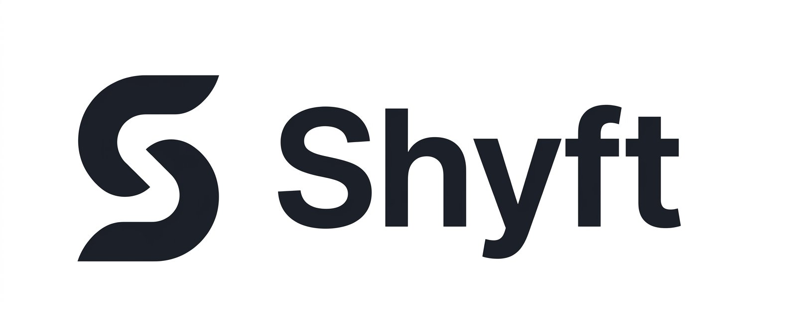

<p align="center">
  
</p>

<p align="center">
  
  
  
  
  
</p>

# Shyft

A decentralized social platform built on Solana with end-to-end encrypted messaging, creator tokens powered by Bags, and a fully gasless experience where users never pay a cent.

**[Live App →](https://www.shyft.lol)**  ·  **[Follow on X →](https://x.com/Shyft_lol)**

---

## What is Shyft?

Shyft is a fully on-chain social platform. Every post, comment, like, follow, and chat message is a Solana transaction — stored permanently on-chain with no centralized database. Users sign in with their X account, get an instant embedded wallet through Privy, and start using the platform immediately. No seed phrases. No gas fees. No SOL required.

Creators can launch personal tokens directly inside Shyft using the Bags SDK. Fans trade them in-app, and every trade generates revenue that flows back through fee sharing.

---

## Features

**Social**
- On-chain profiles, posts, comments, reactions, reposts, and follows
- Real-time feed with auto-refresh and live engagement counters
- Clickable profiles and hover cards (like X/Twitter)
- Image uploads, GIF support, YouTube embeds, rich link previews

**Messaging**
- End-to-end encrypted 1:1 chat using NaCl Box (X25519 + XSalsa20-Poly1305)
- Key exchange and ciphertext stored on-chain — nobody can read your messages except you and the recipient
- In-chat SOL payments

**Creator Tokens**
- Launch personal tokens via Bags SDK with bonding curve pricing
- In-app trading — buy and sell creator tokens without leaving Shyft
- Fee sharing — creators earn passively as their community trades
- Earnings dashboard with claim flow

**Gasless UX**
- Treasury-sponsored transactions — platform pays all gas fees and account rent
- Users never need to own, buy, or hold any SOL
- Privy embedded wallets with silent signing — no wallet popups

---

## Architecture

```
Frontend (Next.js 16 · React 19 · Tailwind CSS 4)
    ↓
ShyftClient (src/lib/program.ts)
    ↓                           ↓
Treasury Sponsorship API    Bags SDK (Mainnet)
  /api/sponsor-tx              Token launch, trade, earnings
    ↓                           ↓
Solana Devnet               Solana Mainnet
  Anchor Program               Bags Protocol
```

| Layer | Technology |
|-------|-----------|
| Frontend | Next.js 16, React 19, Tailwind CSS 4, Zustand |
| Auth | Privy embedded wallets (Twitter OAuth, email, Google) |
| On-chain Program | Rust / Anchor, deployed on Solana Devnet |
| Encryption | NaCl Box via tweetnacl (X25519 + XSalsa20-Poly1305) |
| Creator Tokens | @bagsfm/bags-sdk on Solana Mainnet |
| RPC | Helius |
| Hosting | Vercel |

---

## On-Chain Program

**Program ID:** `EEnouVLAoQGMEbrypEhP3Ct5RgCViCWG4n1nCZNwMxjQ`

All social data is stored as Solana PDAs (Program Derived Addresses). No database.

| Instruction | What It Does |
|------------|-------------|
| `create_profile` | Create an on-chain profile with username, bio, avatar |
| `update_profile` | Update display name, bio, avatar, banner |
| `create_post` | Publish a post on-chain |
| `like_post` | Like a post (increments on-chain counter) |
| `create_comment` | Comment on a post |
| `react_to_post` | React with emoji (❤️ 🔥 🚀 😂 👏 💡) |
| `follow_user` / `unfollow_user` | On-chain follow graph |
| `create_chat` | Initialize an encrypted chat channel |
| `send_message` | Send an E2E encrypted message on-chain |

Every instruction has a separate `payer` signer so the treasury can cover rent while the user only signs to prove identity.

---

## Treasury Sponsorship

Users never pay anything. Here's how:

1. User signs in → Privy creates an embedded Solana wallet (0 SOL balance)
2. User takes an action (post, chat, follow, etc.)
3. Frontend builds the transaction with `feePayer = treasury`
4. User's wallet signs to prove identity
5. Transaction is sent to `/api/sponsor-tx` where the treasury co-signs
6. Treasury pays both the gas fee (~0.000005 SOL) and account rent (~0.003 SOL)

**Cost per user:** ~$0.001 at current SOL prices.

---

## E2E Encrypted Chat

| Component | Technology |
|-----------|-----------|
| Key Derivation | Wallet signs a deterministic message → SHA-256 → X25519 keypair |
| Key Exchange | Public keys published on-chain as the first message in each chat |
| Encryption | NaCl Box (X25519-XSalsa20-Poly1305) with random 24-byte nonces |
| Storage | Ciphertext stored on-chain as Solana PDAs |

Each chat pair has a unique shared secret derived from Diffie-Hellman. Alice's chat with Bob uses a different shared secret than Alice's chat with Carol — full isolation between conversations.

---

## Getting Started

### Prerequisites

- **Node.js 20+** and **npm 10+**
- (Optional, only for editing the on-chain program) Rust + [Anchor CLI](https://www.anchor-lang.com/docs/installation) + [Solana CLI](https://docs.solana.com/cli/install-solana-cli-tools)

### 1. Clone & install

```bash
git clone https://github.com/chandm1213/Shyft.lol.git
cd Shyft.lol
npm install
```

### 2. Set up environment variables

Copy `.env.example` to `.env.local` and fill in your own keys:

```bash
cp .env.example .env.local
```

The **minimum** needed to boot the app locally:

| Variable | Where to get it |
|---|---|
| `NEXT_PUBLIC_HELIUS_API_KEY` | https://helius.dev (free tier) |
| `HELIUS_API_KEY_PRIVATE` | same Helius key (server-only) |
| `NEXT_PUBLIC_PRIVY_APP_ID` | https://dashboard.privy.io |
| `TREASURY_PRIVATE_KEY` | Generate: `solana-keygen new -o treasury.json --no-bip39-passphrase` then paste the array from `cat treasury.json` |
| `BAGS_API_KEY` + `BAGS_PARTNER_WALLET` | https://bags.fm (partner program) |
| `PINATA_JWT` + `PINATA_GATEWAY` | https://pinata.cloud |

Everything else (LiveKit, Upstash, Tenor, xAI, Resend) is **optional** — the related features (voice rooms, push, GIFs, AI button, report emails) gracefully no-op if those keys are missing.

> ⚠️ Fund your treasury wallet with a small amount of SOL on mainnet (~0.5 SOL is plenty for a demo) — it pays all user gas + account rent.

### 3. Run

```bash
npm run dev
```

Open [http://localhost:3000](http://localhost:3000) and sign in with Twitter / Google / email — Privy mints you an embedded Solana wallet on the spot.

### 4. (Optional) Build & deploy the Solana program

The deployed program ID is already hard-coded in `Anchor.toml` and `src/lib/idl.json`, so you can use the existing one without rebuilding. If you want to deploy your own:

```bash
anchor build
anchor deploy --provider.cluster mainnet
# then update the declared id in programs/shadowspace/src/lib.rs and src/lib/idl.json
```

### 5. Deploy to Vercel

```bash
vercel --prod
```

Add every variable from `.env.example` to your Vercel project's **Environment Variables** (Settings → Environment Variables) before deploying.

---

## Project Structure

```
├── programs/shadowspace/     Anchor/Rust on-chain program
│   └── src/lib.rs            All instructions and account structs
├── src/
│   ├── app/                  Next.js app router (pages, API routes)
│   ├── components/           React components (Feed, Chat, Profile, Tokens, etc.)
│   ├── contexts/             Privy wallet provider
│   ├── hooks/                Custom hooks (useProgram, useSessionKey, usePrivatePayment)
│   ├── lib/
│   │   ├── program.ts        ShyftClient — all on-chain interactions
│   │   ├── encryption.ts     NaCl Box E2E encryption utilities
│   │   ├── bags.ts           Bags SDK wrapper (launch, trade, earnings)
│   │   ├── store.ts          Zustand global state
│   │   └── idl.json          Anchor IDL
│   └── types/                TypeScript types
├── target/deploy/            Compiled Solana program (.so)
└── public/                   Static assets
```

---

## Tech Stack

| | |
|---|---|
| **Blockchain** | Solana (Devnet for social, Mainnet for tokens) |
| **Smart Contracts** | Rust, Anchor Framework |
| **Frontend** | Next.js 16, React 19, TypeScript, Tailwind CSS 4 |
| **Auth** | Privy (Twitter OAuth, email, Google, embedded wallets) |
| **Tokens** | Bags SDK (@bagsfm/bags-sdk) |
| **Encryption** | tweetnacl (NaCl Box) |
| **RPC** | Helius |
| **State** | Zustand |
| **Hosting** | Vercel |

---

## Links

- **Live:** [shyft.lol](https://www.shyft.lol)
- **X:** [@Shyft_lol](https://x.com/Shyft_lol)
- **Program:** [`EEnouVLAoQGMEbrypEhP3Ct5RgCViCWG4n1nCZNwMxjQ`](https://explorer.solana.com/address/EEnouVLAoQGMEbrypEhP3Ct5RgCViCWG4n1nCZNwMxjQ?cluster=devnet)

---

<p align="center">
  Built on Solana · Powered by Bags · Secured by NaCl
</p>
